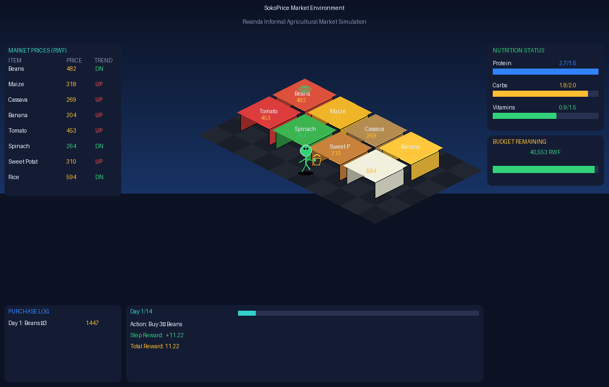

# SokoPrice: RL Market Intelligence Agent

> Empowering Rwandan households with price intelligence and nutrition planning through Reinforcement Learning.

---

## Mission

Rwanda's informal agricultural markets suffer from opaque, volatile pricing that forces households into overspending and poor dietary choices. **SokoPrice** trains an RL agent to act as a market advisor: monitoring daily price fluctuations, issuing spike alerts, selecting nutritionally optimal food items, and managing a household budget over a two-week horizon.

---

## Full Demonstration
**Random Agent Demo**
[Random Agent Demo:  random_agent_demo.gif](demos/best_agent_demo.gif)
 
 **Best Agent Demo**


### Environment Visualization

The agent operates as an animated shopper navigating a custom `SokoPriceEnv`,  a 14-day Rwandan market simulation with 8 food items, stochastic prices, nutritional targets, and a fixed household budget. The environment is rendered in an isometric 3D market scene using PIL with colour-coded stalls, animated agent, and a full HUD overlay.

**Key Features:**
- Custom Gymnasium environment with 27 discrete actions and 25-dimensional observation space
- Isometric 3D visualization: colour-coded market stalls, animated shopper with basket, real-time price board, nutrition bars, budget gauge, and reward curve
- Stalls glow green when purchased, turn red on price spikes
- Price volatility modelled as a random walk around Rwandan market baselines
- Nutrition tracking across protein, carbohydrates, and vitamins with deficit penalties
- Diversity penalty in reward to encourage varied food purchasing
- Alert system: agent learns to flag price spikes and trigger substitution behaviour
- JSON output ready for API / web or mobile integration

---

## Project Structure

```
Nice_Eva_Karabaranga_rl_summative/
├── environment/
│   ├── custom_env.py      # Custom Gymnasium environment
│   ├── rendering.py       # Pygame visualization (fallback)
│   ├── rendering_3d.py    # Isometric 3D visualization (primary, no model and no training)
├── training/
│   ├── dqn_training.py    # DQN: 10 hyperparameter experiments
│   ├── pg_training.py     # REINFORCE + PPO: 10 experiments each
├── models/
│   ├── dqn/               # Saved DQN models (.zip)
│   └── pg/
│       ├── ppo/           # Saved PPO models (.zip)
│       └── reinforce/     # Saved REINFORCE models (.pt)
├── results/
│   ├── dqn/               # DQN results CSV + reward curves
│   └── pg/                # REINFORCE + PPO results CSV + curves
├── main.py                # Entry point; runs best model
├── requirements.txt
└── README.md
```

---

## Setup & Run

```bash
# 1. Clone
git clone https://github.com/Evanice4/Nice_Eva_Karabaranga_rl_summative.git
cd Nice_Eva_Karabaranga_rl_summative

# 2. Install dependencies
pip install -r requirements.txt

# 3. Random agent demo (no training, pure visualization)
python environment/rendering_3d.py
# -> saves random_agent_demo_3d.gif

# 4. Train all models
python training/dqn_training.py
python training/pg_training.py

# 5. Run best agent
python main.py
# -> saves best_agent_demo.gif 
```

---

## Environment Details

### Observation Space (25-dim float32)

| Indices | Description |
|---------|-------------|
| 0-7 | Normalised current prices for 8 food items |
| 8-15 | Price trend (today vs yesterday) |
| 16-18 | Accumulated nutrition [protein, carbs, vitamins] |
| 19 | Remaining budget (normalised) |
| 20 | Day index (normalised) |
| 21–23 | Deficit to daily nutrition target |
| 24 | Active price-spike alert flag |

### Action Space (27 discrete)

| Actions | Description |
|---------|-------------|
| 0–7 | Buy 1 unit of item 0–7 |
| 8–15 | Buy 2 units of item 0–7 |
| 16–23 | Buy 3 units of item 0–7 |
| 24 | Skip (conserve budget) |
| 25 | Issue price alert |
| 26 | Substitute to best value-per-RWF item |

### Reward Structure

| Event | Reward |
|-------|--------|
| Nutrition gain per unit | +2.0 × gain |
| Budget saved per unit | +0.5 × saving ratio |
| Correct spike alert | +1.5 |
| False alert | −0.5 |
| Repeat purchase penalty (>2× same item) | −0.5 per extra |
| Overspend attempt | −2.0 |
| Episode: nutrition deficit | −3.0 × deficit |
| Episode: healthy + within budget | +5.0 bonus |
| Episode: bankruptcy | −5.0 |

### Terminal Conditions
- Day 14 reached (end of 2-week planning horizon)
- Budget exhausted

---

## Algorithms Implemented

| Algorithm | Library | Type |
|-----------|---------|------|
| DQN | Stable Baselines3 | Value-Based |
| REINFORCE | Custom PyTorch | Policy Gradient |
| PPO | Stable Baselines3 | Policy Gradient |

---

## Hyperparameter Experiments

### DQN: 10 Experiments

| # | Experiment | LR | Gamma | Batch | eps_end | Tau | Net Arch | Mean Reward |
|---|------------|----|-------|-------|---------|-----|----------|-------------|
| 1 | **E01_baseline** | **1e-3** | **0.990** | **64** | **0.05** | **1.000** | **[64, 64]** | **135.83** |
| 2 | E02_low_lr | 5e-4 | 0.990 | 64 | 0.05 | 1.000 | [64, 64] | 120.85 |
| 3 | E03_low_gamma | 1e-3 | 0.950 | 64 | 0.05 | 1.000 | [64, 64] | 132.51 |
| 4 | E04_large_batch | 1e-3 | 0.990 | 128 | 0.05 | 1.000 | [64, 64] | 132.98 |
| 5 | E05_large_buffer | 1e-3 | 0.990 | 64 | 0.05 | 1.000 | [64, 64] | 130.32 |
| 6 | E06_low_eps_end | 1e-3 | 0.990 | 64 | 0.01 | 1.000 | [64, 64] | 133.15 |
| 7 | E07_soft_update | 1e-3 | 0.990 | 64 | 0.05 | 0.005 | [64, 64] | 130.98 |
| 8 | E08_wide_net | 1e-3 | 0.990 | 64 | 0.05 | 1.000 | [128, 128] | 132.16 |
| 9 | E09_deep_net | 1e-3 | 0.990 | 64 | 0.05 | 1.000 | [64, 64, 64] | 130.70 |
| 10 | E10_best_guess | 3e-4 | 0.995 | 64 | 0.02 | 0.005 | [128, 128, 64] | 134.20 |

### REINFORCE: 10 Experiments

| # | Experiment | LR | Gamma | Hidden | Entropy Coef | Mean Reward |
|---|------------|----|-------|--------|--------------|-------------|
| 1 | R01_baseline | 1e-3 | 0.990 | [64, 64] | 0.010 | 71.49 |
| 2 | R02_low_lr | 5e-4 | 0.990 | [64, 64] | 0.010 | 75.86 |
| 3 | **R03_high_lr** | **2e-3** | **0.990** | **[64, 64]** | **0.010** | **96.29** |
| 4 | R04_low_gamma | 1e-3 | 0.950 | [64, 64] | 0.010 | 85.11 |
| 5 | R05_wide_net | 1e-3 | 0.990 | [128, 128] | 0.010 | 81.84 |
| 6 | R06_deep_net | 1e-3 | 0.990 | [64, 64, 64] | 0.010 | 83.93 |
| 7 | R07_high_entropy | 1e-3 | 0.990 | [64, 64] | 0.050 | 75.82 |
| 8 | R08_low_entropy | 1e-3 | 0.990 | [64, 64] | 0.001 | 76.07 |
| 9 | R09_high_gamma | 1e-3 | 0.995 | [128, 64] | 0.020 | 83.83 |
| 10 | R10_best_guess | 3e-4 | 0.995 | [128, 128, 64] | 0.020 | 67.99 |

### PPO: 10 Experiments

| # | Experiment | LR | Gamma | n_steps | Batch | Epochs | ent_coef | clip_range | Mean Reward |
|---|------------|----|-------|---------|-------|--------|----------|------------|-------------|
| 1 | P01_baseline | 3e-4 | 0.990 | 2048 | 64 | 10 | 0.01 | 0.2 | 138.46 |
| 2 | P02_low_lr | 1e-4 | 0.990 | 2048 | 64 | 10 | 0.01 | 0.2 | 132.95 |
| 3 | P03_high_lr | 1e-3 | 0.990 | 2048 | 64 | 10 | 0.01 | 0.2 | 139.21 |
| 4 | P04_low_gamma | 3e-4 | 0.950 | 2048 | 64 | 10 | 0.01 | 0.2 | 137.54 |
| 5 | P05_short_rollout | 3e-4 | 0.990 | 1024 | 32 | 10 | 0.01 | 0.2 | 138.90 |
| 6 | P06_large_batch | 3e-4 | 0.990 | 2048 | 128 | 10 | 0.01 | 0.2 | 135.88 |
| 7 | P07_more_epochs | 3e-4 | 0.990 | 2048 | 64 | 20 | 0.01 | 0.2 | 139.06 |
| 8 | P08_high_entropy | 3e-4 | 0.990 | 2048 | 64 | 10 | 0.05 | 0.2 | 138.11 |
| 9 | **P09_wide_clip** | **3e-4** | **0.990** | **2048** | **64** | **10** | **0.01** | **0.3** | **139.49** |
| 10 | P10_best_guess | 2e-4 | 0.995 | 2048 | 64 | 15 | 0.02 | 0.2 | 136.67 |

---

## Results Summary

| # | Algorithm | Best Config | Mean Reward | Type |
|---|-----------|-------------|-------------|------|
| 1 | DQN | E01_baseline | 135.83 | Value-Based |
| 2 | REINFORCE | R03_high_lr | 96.29 | Policy Gradient |
| 3 | **PPO** | **P09_wide_clip** | **139.49** | **Policy Gradient** |

**Best overall: PPO (P09_wide_clip) - Mean reward 139.49**

### Key Insights

- **PPO outperformed DQN** (139.49 vs 135.83); on-policy clipped updates suit the structured daily market decisions of SokoPrice better than off-policy replay
- **REINFORCE scored lower** (96.29) due to high variance without a value baseline, expected for vanilla policy gradient; high learning rate (R03) helped it converge faster
- **Low learning rate hurt DQN** significantly (E02: 120.85), DQN needs a fast enough LR to propagate Q-values through the replay buffer
- **Wider clip range** (P09: clip=0.3) gave PPO a slight edge by allowing larger policy updates per iteration
- **Diversity penalty** in reward successfully eliminated single-item buying behaviour, producing varied purchase logs across food items

---

## API Integration

After running `main.py`, an `agent_summary.json` is produced; ready for a web or mobile frontend:

```json
{
  "algorithm": "ppo",
  "total_reward": 139.49,
  "budget_left": 14276.0,
  "nutrition": { "protein": 22.5, "carbs": 27.0, "vitamins": 15.3 },
  "purchases": [
    { "day": 1, "item": "Beans", "units": 3, "cost": 1000.0 },
    { "day": 2, "item": "Sweet Potato", "units": 3, "cost": 579.0 }
  ]
}
```

---

## Author

**Nice Eva Karabaranga**    